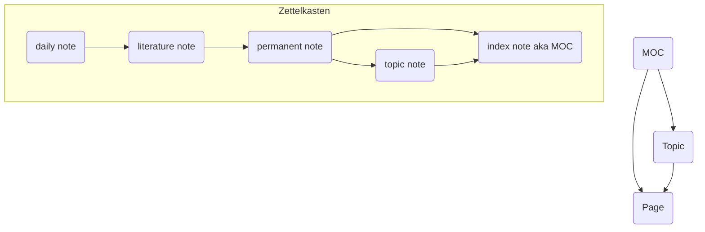

This is an ongoing project to digitize, organize, and expand all of my notes covering topics in computer science and more.

## Indices
This wiki is organized around a hierarchy of indices and sub-indices of interconnected topics. The top level indices are listed below.
[Appreciation of Art (index)](Appreciation%20of%20Art/Appreciation%20of%20Art%20(index).md)

## Vault Workflow
