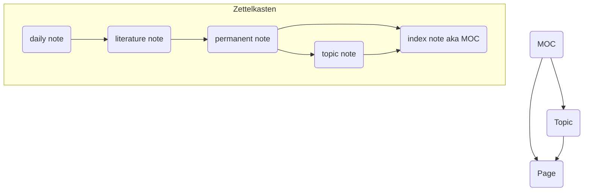

This is an ongoing project to digitize, organize, and expand all of my notes covering topics in computer science and more.

## Indices
This wiki is organized around a hierarchy of indices and sub-indices of interconnected topics. Some of the top level incides are listed below and everything is listed on the left.

## Vault Workflow
